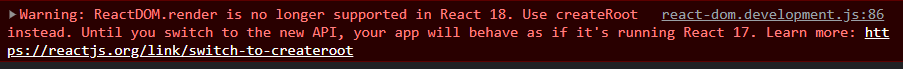

유데미 리액트 강의를 듣던 중에 다음과 같은 오류가 나왔다.



`index.js` 에는 코드가 이렇게 되어있었는데

```js
import React from 'react';
import ReactDOM from 'react-dom';
import App from './App';

ReactDOM.render(
  <React.StrictMode>
    <App />
  </React.StrictMode>,
  document.getElementById('root'),
);
```

이 코드는 17버전이라, 18버전하고는 호환이 안된다.

```js
import React from 'react';
import * as ReactDOM from 'react-dom/client';
import './index.css';
import App from './App';

const root = ReactDOM.createRoot(document.getElementById('root'));
root.render(<App />);
```

구글링해서 금방 찾았지만, 언제나 18버전을 쓴다고 확실하진 않기 때문에 만일 이런 상황에 또 마주치면 시간낭비를 조금이라도 하지 않기 위해 기록해두는 편이 낫겠다 싶었다.
