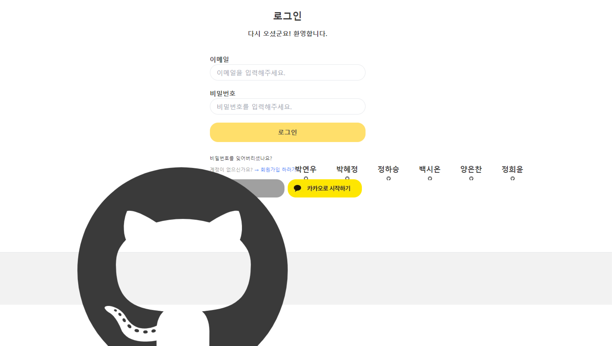
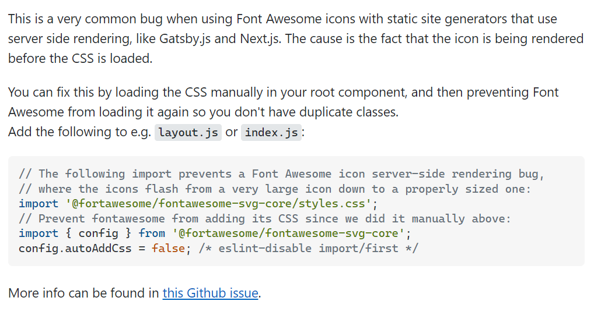

메인 프로젝트를 진행하면서 컴포넌트를 만들던 중에 갑자기 이렇게 footer 부분에서 FontAwesome icon이 상대적으로 엄청 커지는 현상이 발생했다.



구글링해서 찾아보니 이러한 답변을 볼 수 있었다.



프로젝트 환경은 `Next.js`였고 일반 리액트가 아닌 Next나 Gatsby 같은 환경에서는 FontAwesome icon이 CSS가 로드되기 전에 먼저 렌더링 되기 때문에 생기는 버그라고 한다.

다음과 같이 `_app.tsx`에 미리 렌더링을 방지하는 코드를 작성했다.

```tsx
// fontAwesome 미리 렌더링 방지
import '@fortawesome/fontawesome-svg-core/styles.css';
import { config } from '@fortawesome/fontawesome-svg-core';
config.autoAddCss = false;
```

### Reference

- <a href='https://stackoverflow.com/questions/56334381/why-my-font-awesome-icons-are-being-displayed-big-at-first-and-then-updated-to-t'>Why my font-awesome icons are being displayed big at first and then updated to the right size?</a>

- <a href='https://github.com/FortAwesome/react-fontawesome/issues/134'>Over sized icons on each page refresh</a>
