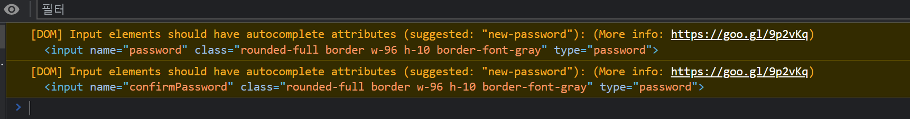

메인 프로젝트에서 react-hook-form을 이용해 로그인 컴포넌트를 만들던 중에



위와 같은 경고가 발생했다.

```tsx
<input
  {...register('password', { required: true })}
  className="rounded-full border w-96 h-10 border-font-gray"
  type="password"
/>
```

이렇게 코드를 짰었는데 찾아보니 경고 메시지 그대로 ` autoComplete` 속성을 추가해줘야 하고 이것이 유저 경험을 높이는 방법 중에 하나라고 한다.

로그인 폼 같은 곳에서 사용되는 input을 다룬지 좀 오래되다보니 그새 기능이 추가된 모양이다.

프로젝트 하면서 전혀 몰랐던 부분인데 이번에 정말 다행이다.

### Reference

- <a href='https://velog.io/@tjdgus0528/autocomplete-attributes'>[html]autocomplete attributes</a>

- <a href='https://www.chromium.org/developers/design-documents/create-amazing-password-forms/'>Create Amazing Password Forms</a>
