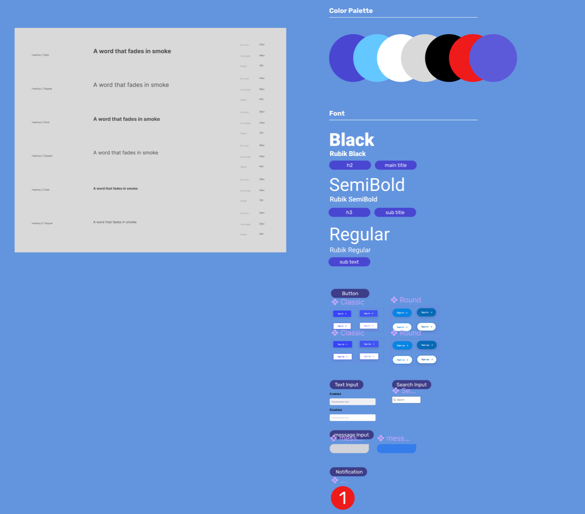

기업 과제를 하면서 이제는 무작정 코딩에 들어가는 것이 아닌 어느정도 디자인은 해놓고 코딩 작업을 하는것이 좋겠다고 생각한지 몇 달 쯤 됐다.

이 이후로 디자인 - 코딩 순으로 시작을 했는데 무지성으로 프레임이랑 컴포넌트 제작하고 하다보니 뭔가 기준이 없다는 생각이 들어서 가이드를 따로 만들었다.

가이드를 만들고 작업을 했지만 프레임 크기에 따라 또 조정이 필요했는데, 이러한 것도 일일이 다 수작업이 필요한가..? 싶었다.

나중에 실무에 가서 디자이너분과 협업을 하면서 느끼겠지만 지금 혼자 하는 작업에 있어서도 많은 어려움을 느끼는 것 같다.

솔직히 **디자인 시스템** 이라는 게 며칠만에 뚝딱 나오는 게 아니라고 생각하는데다, 이렇게 만들어 놓은 것도 과연 맞는건가 싶다.

디자인 시스템을 도입한 것도 이번이 처음이기 때문에 토이 프로젝트나 과제를 하면서 성장해 나가지 않을 까하는 기대도 된다.

 
