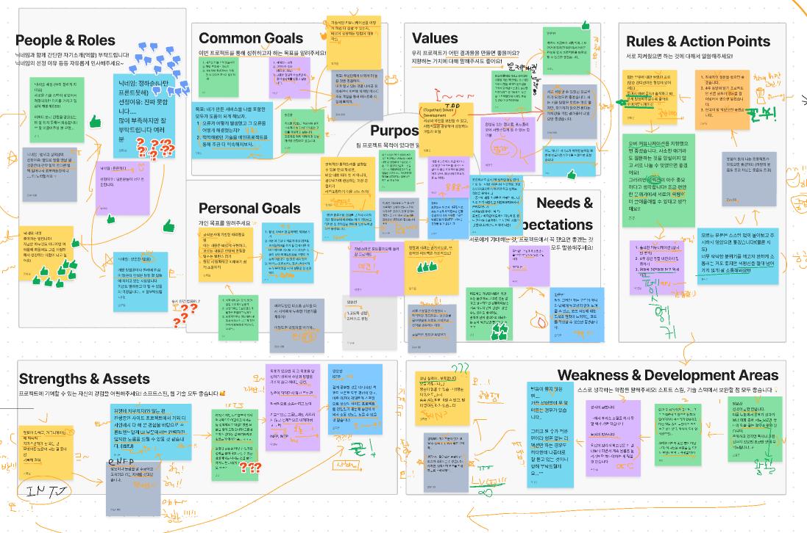

메인 프로젝트가 시작되기 전부터 아이디어를 2개 정도 생각해서 프론트 팀원들끼리 의견을 제시했었는데, 본격적으로 시작된 이후에는 백엔드 팀원분들의 의견도 같이 모아지다보니 컨셉이 좀 무너지는 느낌이 들었는데 처음부터 프론트,백 다 모여서 진행했으면 어땠을까 하는 생각도 들었었다.

프로젝트 시작 전에 이렇게 아이스브레이킹도 진행했다.

데일리스크럼을 통해 각자 진행한일/할일 컨디션 체크 및 협의할 내용 등을 공유했다.

## 기획 과정

기존 개발 커뮤니티의 경우에는 딱딱한 감이 없지 않아 있어서 좀 더 유한 분위기로 가면 괜찮겠다 싶었고 팀원들한테도 컨셉을 정확하게 가져갔으면 좋겠다고 얘기를 했었다.

### 플로우 차트 구성

피그잼에 작성했던 요구사항을 바탕으로 플로우 차트 작성에 들어갔을 때는 어려운 점이 있었다기 보다는 다른 지인들과 하고 있는 사이드 프로젝트에서는 정말 자세하다 보니 기획+디자인+개발을 1달이라는 짧은 기간에는 어떻게 플로우차트를 구성해야 할 지에 대해 고민이 많았었고

와이어프레임 단계에 들어서면서 좀 더 플로우차트에 부족한 부분이 있는지 체크하고 보완을 해나갔었다.

### 와이어프레임 구성

이제 기획하고 플로우 차트 그리는 부분은 어느정도 끝냈는데..이걸 어떻게 뷰로 보여주지?부터 되게 막막했다. 그동안 노마드코더에서 클론코딩 위주로 공부를 하다보니 어디부터 건드려야 할 지 감이 안 왔었다. UX 원칙이라는 책을 너무 재밌게 읽었어서 와이어프레임 단계에서 한번 적용해볼까 싶었는데 책에서 제시한 의견이 무조건 정답도 아니고 무엇보다 팀으로 작업하면서 팀원들 간의 의견도 서로 다르다보니 무조건 내 의견을 밀고 나갈수는 없었다.

컨셉을 정하면서 메인 컬러도 가져가면 좋다고 생각했고 우리팀은 따뜻한 **노랑/주황 계열**로 가져갔다.

## 라이브러리 선정

먼저 코어 스택으로는 `Next`를 사용했는데 커뮤니티는 SEO에 걸리는 게 중요하다고 생각했고, 일반 리액트로는 SEO를 구현해내기가 어렵기 때문에 난이도 측면에서는 도전적이었지만 사용하기로 했다.

그리고 CSS는 `Tailwind`와 `styled-components` 중 어느것을 고를지 많이 고민했었다. 최근 CSS-In-JS가 느리고 그렇기 때문에 지양하고 있다는 블로그를 봐서 그런지 Tailwind가 너무 좋아보이는 느낌이 들었다. 개인적으로는 styled-components 보다는 tailwind가 어떻게 css 적용이 되어있는지 한눈에 파악하기가 쉽기 때문이었다.

아직까지는 이 2개를 깊게 파고든 적은 사실 없어서 나중에 이러한 것들을 도입하자는 의견을 낼 때도 확실하게 할 수 있도록 더 많은 공부가 필요하다.

**서버 데이터 관리 라이브러리**는 프리 프로젝트 때도 새로운 걸 도전해보자는 마음에서 리액트 쿼리를 사용했지만 메인에는 다른 걸 써보면 어떨까 싶었다. 리액트 쿼리에는 상대적으로 프로젝트 크기가 큰 경우에 사용을 하면 좋다는 글을 봤었는데 지금 생각해보면 프리 때는 그냥 axios를 써도 괜찮았을 거 같다… 아무튼 메인에서는 `SWR`이라는 라이브러리를 사용하였다.

### 구현했던 것들

크게는 유저 인증 및 글 작성을 담당했다.

프리 프로젝트 때도 로그인/회원가입을 해보지 않아서 혼자 걱정이 많았다. 처음 회원가입을 할 때부터 막막했는데 이메일 인증을 하는 부분에서 프론트 쪽에서 굳이 신경을 안 써도 될 부분을 구글링 하면서 시간을 많이 허비했던 기억이 있었다. 더군다나 로그인/회원가입 기능이 끝나야 글 작성/수정, 답변, 좋아요 기능 등의 구현이 가능했기 때문에 부담을 많이 가졌었다.

담당 백엔드 팀원분과 소통을 진행하고, 또한 다른 프론트 팀원분들의 도움도 받아 결국 구현해 낼 수 있었고 유저 인증에 그렇게 두려움을 가지지 않아도 된다는 생각이 들었다.

아쉬웠던 점은 딱히 없었고 다만, 처음 입력 시부터 유효성 검사를 하면 어떨까 싶어서 이거를 한번 추가해보고 싶다.

글 작성 기능을 구현하면서 React Quill 라이브러리를 썼었는데 아무래도 환경이 next다보니 해당 에디터는 SSR을 지원을 하지 않아서 dynamic import 기법을 사용했다.

그리고 스택오버플로우처럼 코드블럭도 추가할 필요가 있었는데 처음에 계속 블로그를 찾아보면서 구현을 할려고 하다가 잘 안되서 다른 라이브러리를 사용하려고 했다.

그냥 React-quill에서 기본적으로 제공하는 거에 추가로 code-block만 추가하면 됐다. 그런데 일반 텍스트 느낌이 있어서 하이라이트하는 기능을 추가해보고 싶다.

### 배운 점

다른 팀원 한 분이 글 작성 시간 표현을 했는데 코드 리뷰를 하면서 `<time>` 태그가 있다는 것을 알게 되었다.

### 좋았던 점

프리 프로젝트 때는 진행하지 않았던 브랜치 보호 룰을 팀원 한 분이 적용하자고 제안했었다. PR이 approve가 안되면 merge가 안되도록 하는 방식이었는데 덕분에 PR 날릴 때마다 코드리뷰를 주고 받을 수 있었어서 좋았다.

평소에 에러나 경고를 마주치면 따로 기록을 해두는 편인데 이번 프로젝트에서도 역시 피해갈 수 없었다. 하지만 이 같은 실수를 왜 범했고 어떻게 해결했는지 적다보니 왠지 모를 뿌듯함이 들었고 내 나름대로 성장하고 있구나를 느꼈다.

메인 프로젝트 때는 1주일에 한 번 멘토링을 진행했는데 취업이나 프로젝트 관련에 대해 많이 도움을 받을 수 있었다.

### 아쉬운 점

이후에도 더 리팩토링을 진행하겠지만 프로젝트 기간동안에는 next와 typescript를 그렇게 많이 끌어다 쓴 거 같지는 않아서 좀 아쉬웠다.

특히 **타입스크립트**는 프로젝트 때 활용해볼려고 블로그도 찾아보고 깃허브에도 따로 star 했었는데 별로 활용을 못해서 아쉬웠지만 다음 사이드 프로젝트에는 적용해보고 싶다.

그리고 프로젝트 초반에 시간적으로 여유가 된다면 함수형 프로그래밍을 적용해보자 했었는데

기능구현을 하느라 너무 급급했고, 나 같은 경우에는 코로나로 인해 중간에 거의 진행을 할 수가 없었다.

컴포넌트 설계 시 아토믹 디자인이라는 것을 알게 돼서 도입을 해보려 했지만 1달이라는 짧은 기간 내에는 힘들 거 같아 팀원 각자 기준으로 코드가 너무 길어지면 따로 컴포넌트로 빼는 방법을 사용했는데

정확히 디자인 시스템을 잘 모르는 상태여서 추후에 프로젝트에 맞는 시스템을 도입하고 싶다.

내가 구현했던 기능 중에 SWR을 사용한 경우는 데이터를 fetching해오는 경우 말고는 없었어서 개인적으로 많이 아쉬웠다.
