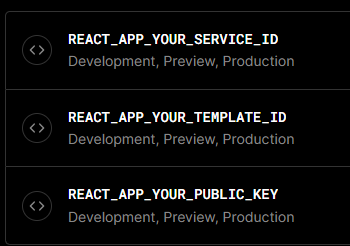

포트폴리오 작업 중에 Contact 페이지를 만들면서 `emailjs`라는 라이브러리를 사용할 일이 생겼는데,

이 라이브러리를 사용하기 위해서는

```js
emailjs.sendForm('YOUR_SERVICE_ID', 'YOUR_TEMPLATE_ID', form.current, 'YOUR_PUBLIC_KEY').then(
  (result) => {
    console.log(result.text);
  },
  (error) => {
    console.log(error.text);
  },
);
```

`SERVICE_ID`, `TEMPLATE_ID`와 `PUBLIC_KEY`를 등록해야 가능하다.

.env 파일에 넣어놓고 배포 진행하고 나서 잘 작동되나 봤더니 안 보내진다...

블로그를 좀 찾아보다가 직접적인 힌트는 얻은 건 아니지만



<br/>

Vercel에 이렇게 등록을 했어야 하는데 env 파일에만 넣어놓고 '로컬에서는 잘 되는데 왜 배포하면 안되지?'라고 시간을 허비했다...

<br/>


<p align='center' style='color:gray'><small><br/>Send Message 버튼을 클릭하면 토스트가 뜨도록 했다.</small>
