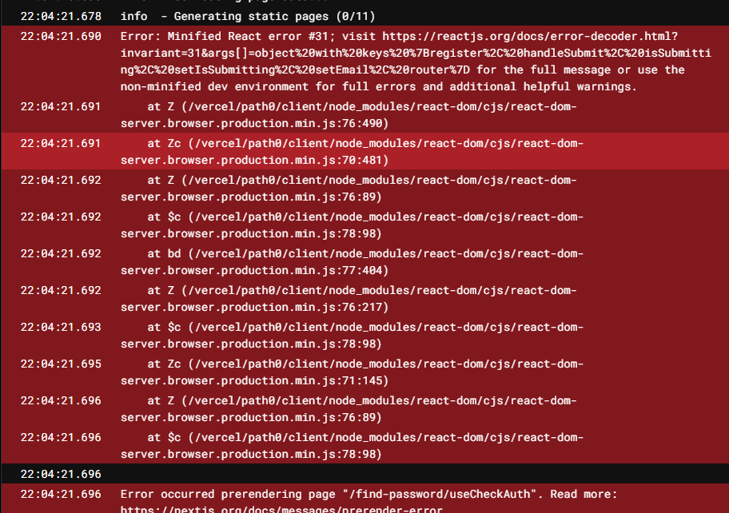

```tsx
export const useCheckAuth = () => {
  const { register, handleSubmit } = useForm<AuthResp>({ mode: 'onChange' });
  const [isSubmitting, setIsSubmitting] = useState(false);
  const setEmail = useSetRecoilState(userEmailAtom);
  const router = useRouter();
  return {
    register,
    handleSubmit,
    isSubmitting,
    setIsSubmitting,
    setEmail,
    router,
  };
};
```

리팩토링을 진행하던 중에 위와 같은 코드를 작성했었는데..



<br />

vercel에 빌드하고 나니 빌드 에러가 터졌다.

쭉 보니 내가 만든 `useCheckAuth.tsx`라는 파일이 문제였다.

다행히도 next 문서에 친절하게 알려주고 있었다.

가장 첫번째에 나오는 `Make sure to move any non-pages out of the pages folder`라는 문구가 나온다. 즉 hooks는 pages 폴더에 넣지 말라는 얘긴데,

내가 생각해봤을 때, pages 폴더 내에 있는 파일들은 라우팅 용도로 사용되고, pages 폴더 내에 있는 파일들에 hooks가 사용된다 하더라도, hooks 자체는 라우팅과 직접적인 연관이 없어서 그런 것 같다.

단순히 리액트로만 개발을 했을 때는 hooks를 만들어도 전혀 상관이 없었는데,

nextjs는 프레임워크라 그런지 제한사항이 제법 있다.

리팩토링 작업을 하면서 더 마주치게 되겠지만 하마터면 몰랐을 지식을 조금씩 알아가는 것 같아서 뿌듯하다.

### 참고자료

- https://nextjs.org/docs/messages/prerender-error
