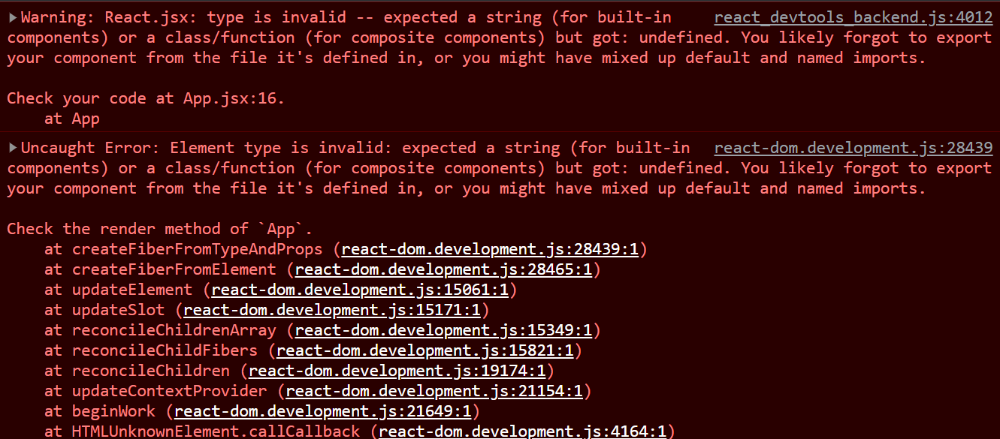

react-query에서 devtools를 사용하기 위해

```js
import { ReactQueryDevtools } from 'react-query';
```

처럼 import 했는데,



타입이 invalid하다는데 이게 타입이랑 뭔 상관이 있나 싶어서 구글링해보니

```js
import { ReactQueryDevtools } from 'react-query/devtools';
```

devtools가 react-query/devtools 패키지에 포함되어 있다고 한다.

리액트쿼리 오랜만에 공부하는 김에 기록 좀 열심히 해야지...

### Reference

https://www.js2uix.com/frontend/react-query-step1/
