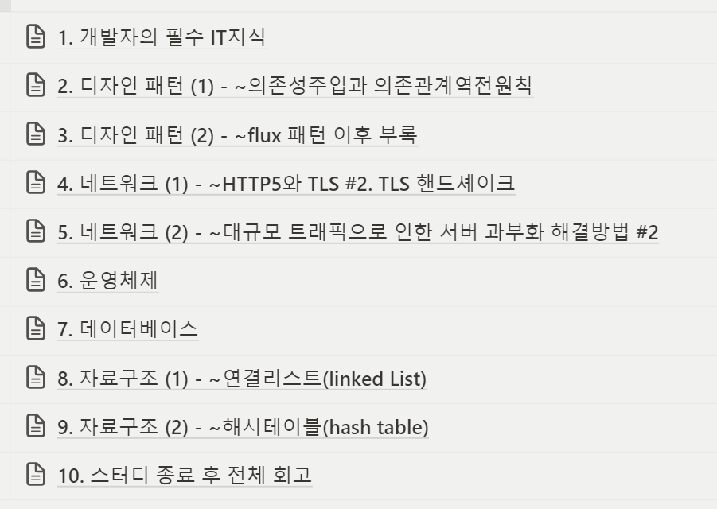

### CS스터디를 시작한 이유

면접에서 CS 관련 질문이 들어올 때 모르는 부분에 대해서는 답을 못했던 경험이 있어서 공부를 더 해보자 마음은 먹었지만 CS스터디를 혼자서 공부하려니 어느 부분부터 할지도 감이 안 잡혔고, 무엇보다 혼자 하면 늘어질 게 뻔해서 사람을 모아서 인프런에 있는 CS 스터디 강의 자료를 이용했다.

### 진행 방식

팀원끼리 주제를 적절하게 나눠서 매주 한번씩 돌아가면서 발표하는 식으로 진행했고 주차별로 간단하게 느낀 점 등이나 회고를 적었다.

### 좋았던 부분

파편화 됐던 개념이나 용어들을 CS스터디를 통해서 다시금 정리해 볼 수 있어서 좋았고(물론 다시 공부해야 하지만) 내가 조사한 부분 외에도 다른 팀원들의 발표를 들으면서 개념을 잡을 수 있었다.

### 어려웠던 부분 or 아쉬웠던 부분

해당 강의 자료가 프론트엔드 뿐만 아니라 백엔드,네트워크 같은 부분도 다루고 있었기 때문에 조금 익숙하지 않은 부분도 많았다. 물론 블로그나 영상 등에 나와있는 시각적인 자료를 통해 어느 정도 개념은 잡았긴 했지만 아직까진 컴퓨터적인 사고가 부족해서 이해가 안됐던 것 같다.

그리고 어느 파트던 간에 실제로 적용해보고 나서야 그 의미를 제대로 알 수가 있는 것이기 때문에 이러한 부분에서도 조금 아쉬운 면이 있었다.

### 마무리
약 2달간의 스터디가 끝이 났다. 혼자서 할려고 했으면 과연 얼마나 걸렸을까..라는 생각도 하게 된다. CS를 공부하는 게 물론 면접에서 잘 답변을 하는 목적도 있겠지만, 나중에 실무를 할 때 이러한 부분에서 CS 지식이 필요하다고 깨달을 순간이 올 것이다. 뭐든지 간에 실제로 적용하면서 얻는 경험이 무엇보다 중요한 거 같은데, ~~얼른 적용해 볼 날이 왔으면..~~