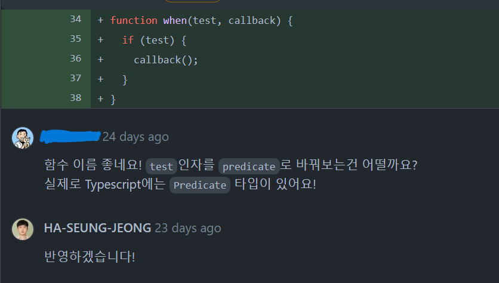
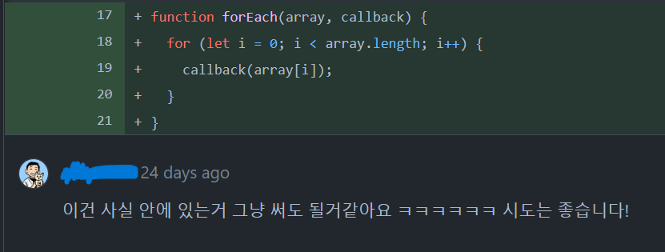

진행기간 : 2022.07.18 ~ 2022.08.27

## 과연 내가 이걸 할 수 있을까...?

처음에 디스코드에서 저 책을 통해서 스터디를 하자고 했을 때 조금 망설였다.

스터디장님 왈 "이걸 읽으면 면접에서 정말 도움될 거에요"라고 하시길래 혹해서 바로 책을 살려고 했다.

독자 대상으로 **2~5년차** 개발자라길래

이거를 개발자도 아닌 내가 읽을 수 있을까 싶었다.

현업 개발자분들이랑 하는거지만 솔직히 사이드프로젝트도 아니고 독서 스터디이기 때문에(?)

한번 해볼까? 하는 마음에 해보자! 라는 마음으로 시작했다.

## 문제 풀이와 코드 리뷰

매주 일요일마다 모여서 각자 문제를 만들어오면서 주간과제를 하거나 스터디 시간 내에 풀 수 있는 문제를 풀었다.

처음에 문제를 낼 당시에는 이전에 다른 강의로 함수형을 어느정도 공부한 적은 있었다.

그렇기 때문에 이걸 한번 적용해보고자 하는 마음이 앞섰지만 다른 스터디원들이 낸 문제를 보면서

내 문제는 뭔가 퀄리티가 떨어져보이기도 했다... 그렇지만 그게 뭐가 중요한가.

솔직히 문제를 만들면서 스트레스를 안 받았다고 하면 거짓말이다.

### 코드 리뷰를 주고 받으면서 느낀 점

<small>책에 있는 부분을 활용한거긴 하지만 그래도 기분은 좋았다.</small>

`forEach` 부분도 함수로 뺐는데 조금 과하다는 지적을 받았다. 나중에 보니 이 책이 ES5 버전으로 만들어졌고

이 때 당시에는 `forEach`를 직접 구현했다고 한다.(웬만하면 내장 메소드는 걍 활용하자...)

스터디 중후반부 쯤에는 나도 코드리뷰를 몇 번 했다. 난 코드리뷰 할 실력도 없는데 무슨 리뷰를 하지..? 했지만

코드리뷰라는게 '이 코드는 이렇게 바꾸면 더 좋을 거 같아요'라는 방식뿐만이 아닌 진짜 말 그대로 **리뷰**기 때문에

내가 코드를 보고 느낀 점을 적어도 되겠구나 싶었다.

아마 이 스터디에 참여를 안 했으면 취업할 때까지 코드리뷰는 경험해보지 못했을 것 같다.

## 책을 읽어나가면서

여러번 더 읽어야 하지만 아무튼 1회독은 완료했다. 혼자 읽었다면 절대 못했을 거 같은데

어쨌든 범위를 나누면서 매주 읽어나가니까 한달 좀 넘는 기간동안에 다 읽을 수 있었다.

이 책을 읽으면서 가장 마음에 들었던 부분은 글로만 장황하게 설명하거나 코드로만 설명하지 않고

실생활에 나올만한 걸 비유 및 그림을 통해서 설명했다는 점이다. 그래서 책 초반에는 되게 재밌게 읽었다.

하지만 15장부터는 타임라인 다이어그램 같은 어려운 용어가 등장하기 시작하면서 한마디로 뇌정지가 와버렸다...

내가 아직 자바스크립트에 대해서 완벽하게 아는 것도 아닐뿐더러 실무에서 나올만한 용어들도 가끔씩 등장해서 좀 벅찬 느낌이 있었다.

이 책을 한번 띡 읽었다고 끝내면 무슨 의미가 있겠나 싶어서 여러 번 더 읽으려고 한다. 아마 이 책은 몇 년 동안은 계속 가지고 있을 것 같다. 정말 도움되는 책이다.

## 마무리

### 기존 코드에 한번 적용해볼까?

배웠으니까 써먹어야지. 강의를 들으면서 짰던 코드나 지금 하고 있는 부트캠프에서 진행한 코드에서도 리팩토링을 할 수 있다는 자신감이 조금은 들었다.

몇 주 전에 치른 토스 NEXT 챌린지에 나온 문제 중 이론을 물어보는 게 아닌 코드를 직접 짠 경험이 있는지 물어보는 문항이 있었다.

나는 이 스터디를 하면서 리팩토링을 경험해 본 적이 있기 때문에 당황하지 않고 내가 만들었던 코드 조각을 낼 수 있었다.(떨어졌지만...)

그리고 지금 진행 중인 사이드 프로젝트를 하면서 코딩 작업을 할 때 바로 적용해보고 싶다.

### 개선할 점

아직은 기존의 더러운 코드를 보고 어떤 코드부터 정리해야할 지는 제대로 감이 안온다.

물론 중복된 코드를 찾아낼 정도는 됐지만 이걸 어떻게 함수로 따로 빼가지고 똑같이 작동하도록 하는 지는 어렵다.(네이밍도 문제다..)

책을 여러번 읽으면서 코드에도 적용해보는 연습이 더 필요하다.

그리고 책에 나온 내용처럼 아직 액션,데이터,계산 이 3개의 개념도 제대로 안 잡혔기 때문에 숙련..숙련이 중요하다.

끝으로 이 책을 추천하냐라고 묻는다면 답은 YES다.

단순히 코드를 함수형으로 짜는 법을 알려주는 게 아니라 어떻게 코드를 확장성있게 만들 수 있는지 알려주는 책이다.

자바스크립트를 처음 해본다면 조금은 어려울 수 있겠지만, 어느 정도 해본 사람이라면 확실히 인사이트를 얻을 수 있을 것이다.
