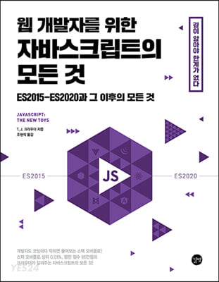

히카맹님 개발 커뮤니티를 하면서 이름만 들어보다가 코드스피츠 유튜브 영상을 보면서 같은 분인걸 알게 됐다...ㅋㅋㅋㅋ

며칠 전에 자바스크립트 스터디를 개설하신다는 얘기를 듣고 일단 후다닥 신청했다.

 
진행하는 책 목차를 보니 내용이 좀 많아 보였지만 책을 사고 4장 정도까지 본 결과

- 입문용 책은 절대 아니다.
- 번역이 조금 이상한 감이 있다.

이 정도인데, 이해할 때까지 더 읽어봐야 할 거 같다...

27일부터 매주 스터디 시작인데, 알고 있는 스터디원이 다 현업자분들이라 내가 과연 버틸 수 있을지 모르겠다..

히카맹님 스터디가 상당히 빡센 편이라고 들어서 완주할 수 있을까 과연?

토론 방식으로 진행된다고 하는데, 모든 인원이 토론 준비를 다 해야 하나보다. 재밌을 거 같으면서도 제대로 준비가 가능할지는 의문이지만 완주를 하면 좋은 경험이 될 거 같다.
