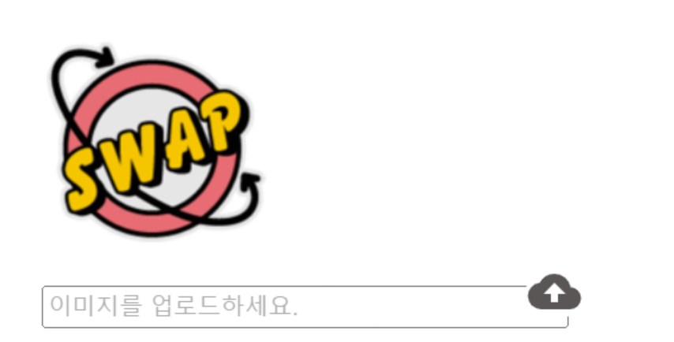

<br/>

input 컴포넌트랑 구름 아이콘을 같은 라인에 맞추고 싶었는데 뭔가 계속 정렬이 안됐었다.

아이콘으로 `react-icons`를 사용하고 있었는데 이게 문젠가 싶어서

컴포넌트를 봐도 딱히 충돌할만한 것들이 안 보여서 팀원들에게 도움(?)을 요청했다.

다른 파일에서

```jsx
 .plus {
    position: relative;
    top: 7rem;
    right: 2rem;
    width: 2rem;
    height: 2rem;
 }
```

이런식으로 plus라는 클래스네임을 추가해서 마크업을 진행했었는데, 또 다른 파일에서도 같은 클래스네임을 사용했다.

`styled-components`에서 컴포넌트 단위로 CSS를 만들면 랜덤하게 클래스네임이 배정되는데 명시적인 이름으로 사용하면 이름 그대로 붙어버리기 때문에 중복으로 css 적용이 돼서 내가 원하는대로 안 나왔던 것 같다.

그냥 간단하게 클래스네임만 다르게 해서 해주니 바로 해결되었다.
