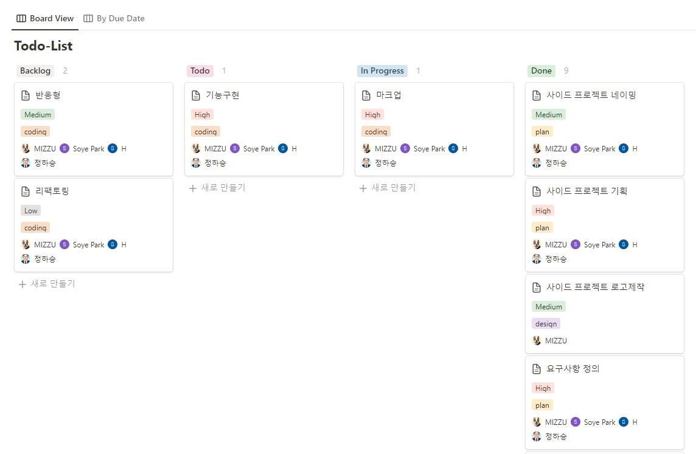

작년 7월부터 Swap 프로젝트를 시작했다. 한 분이 취업으로 인해 프로젝트는 잠정적으로 중단되었지만, 그동안에 했던 것과 느꼈던 점들을 늦게나마 회고해보고자 한다.

### 기획부터 디자인까지

매일 swap 프로젝트에만 집중할 수 없었기 때문에 주 2회 정도로 하여 진행했다. 이전에 했던 프로젝트도 와이어 프레임이나 플로우차트를 그리면서 진행했지만, 체계가 제대로 안 잡혀있었고, 직장인과 작업을 하다 보니 제대로 시간을 잡기가 어려웠었다.

이번에는 디자인학과에 다니시는 분이 주도하여 좀 더 체계적으로 했다. 요구사항과 기능명세서, 그리고 플로우차트와 와이어 프레임을 다 같이 작성하고 문서화를 했고 서로 피드백도 진행했었다.

프로젝트를 하면서 늘어진 적도 있었지만, 문서화를 해놓았기 때문에 기능 구현까지 갈 수 있지 않았을까 싶다.

 

### 커밋템플릿 적용

커밋템플릿을 적용하기 이전에는 이런 게 있었는지 알지 못했다. 물론 커밋 메시지를 직접 작성할 수도 있지만 이 부분도 `.gitmessage`라는 것을 활용해서 문서화를 진행했고, 구현했던 기능에 대해 조금 더 자세하게 커밋을 남길 수 있었다. 덕분에 다른 팀원분이 구현했던 기능에 대해서 잘 파악할 수 있게 됐고, 수정한 부분에 대해서도 인지를 빠르게 할 수 있었다.

 

 

### 변수, 함수 네이밍에 대한 고민

컴포넌트 제작 과정에서 컴포넌트 네이밍에 대한 고민을 했었다. 내가 만든 컴포넌트를 다른 개발자가 사용할 수도 있기 때문에 신중하게 네이밍을 진행해야 했고, 심지어 나만 쓰는 컴포넌트라도 컴포넌트 분리 등의 작업을 하다 보면 헷갈릴 가능성이 있어서 무지성으로 짓다보면 꼬이게 되면 작업 시간이 더 늘어날 수 있기 때문이다.

또한 함수 네이밍에 대해서는 동사 형태로 지어야 한다는 컨벤션을 따라서 작성했지만, 나중에 기능이 더 커지고 복잡해질 경우나 리팩토링하는 과정에서 함수 이름이 자칫 길어질 가능성에 대해서는 조금 더 깊이 고민을 해봐야 할 것 같다.

결론적으로, 협업하면서 코드로 소통을 하기 때문에 직관적인 네이밍을 통해 동료 개발자가 바로바로 컴포넌트나 함수를 사용할 수 있게끔 하는 게 업무 생산성에 도움이 되지 않을까 싶다.

### TypeScript 마이그레이션

처음에는 JavaScript로만 진행했었다. 그러던 중에 채용공고에는 TypeScript가 필수사항으로 기재된 기업들이 많았다. 그렇기 때문에 TypeScript 도입 의견이 나왔었는데 아직은 팀원 모두가 익숙하지 않은 상황이었고, 배우면서 하기에는 시간이 너무 지체될 것 같았다.

하지만 다른 팀원분이 TypeScipt로 마이그레이션 한다고 해서 파일을 전부 `.ts`, `.tsx` 로 바꿔야 하는 게 아니라 일부분만 바꿔도 된다는 의견을 듣고 납득했다. 이전에 제일 걱정했던 부분은 이때까지 JavaScript로 기능 구현해 놓았는데 TypeScript로 바꾸면 에러가 엄청나게 터지지 않을까 하는 것이었다.

물론 마이그레이션을 하는 과정에서 난관은 있었지만, 해결 못 하는 부분은 아니었고 다른 팀원 분과 같이 작업을 하여 무사히 마무리할 수 있었다.

### 코드 리뷰

 

개발하면서 필수(?)라고 할 수 있는 코드 리뷰도 진행했다.

내가 작성한 코드에 대해 다른 개발자들은 어떻게 생각하고 있는지, 더 좋은 의견이 있다면 그것을 수용하는 자세, 그리고 실수한 부분에 대해서는 고쳐나가면서 작업했기 때문에 적어도 우물 안 개구리가 되지는 않았던 것 같다.

### 피그마 작업

작업을 하면서 디자인 시스템이 정말로 중요하다고 느꼈던 부분이 색상/크기, 폰트에 대한 기준이 잡혀 있던 것이었다. 덕분에 와이어프레임을 최대한 빠르게 하고 프로토타이핑까지 완료할 수 있었다.

디자인 시스템 작업에 대해서는 대부분 디자이너가 해주겠지만 어떻게 프로세스가 이루어지는지에 대해서는 한번 배워볼 기회가 있었으면 좋겠다는 생각도 들었다.

### 마무리

프로젝트를 하고 몇 달이 지나서야 회고하는 바람에 제대로 기억하지 못한 부분이 있었던 것 같다. 앞으로 프로젝트를 하고 나서나 뭔가를 만들고 나서라도 회고는 제때 하는 습관을 들여놔야 할 것 같다.
