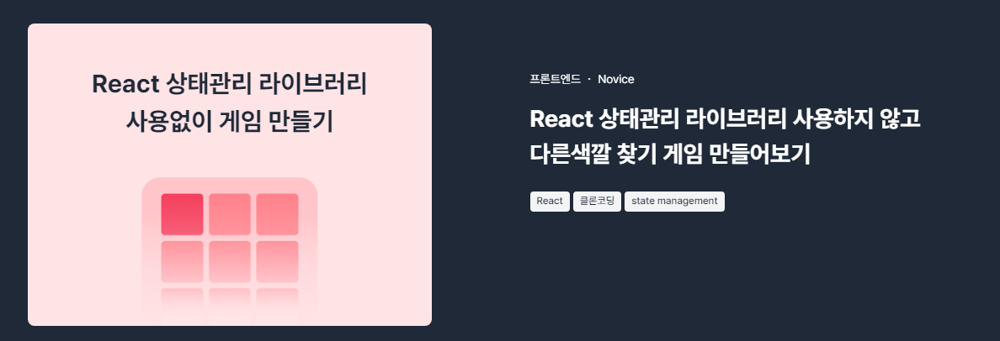

## 시작하게 된 이유

지인으로 넘블이라는 곳에서 진행하는 챌린지가 있었는데,


<br/>

알아보던 중 프론트엔드 쪽에 모집 중인 챌린지가 있어서 살펴봤더니

Redux, Recoil, Context 등의 상태관리 툴 없이 다른 색깔을 찾는 게임을 만들어 보는 게 있었다.

평소에 아이디어가 잘 생각이 나지 않았는데, 뭔가라도 만들어 보고 싶어서 바로 신청했다.

## 좋았던 점

마감된 챌린지도 살펴봤는데 소개팅 앱이나 단톡방 등의 주제도 있었다. 같은 게 반복되는 게 아니라 매달 다른 주제로 올라오는 느낌이 들어서 좋았다. 다음 달에도 여유가 되면 참여해 볼 생각이다.

## 배운 점과 어려웠던 부분

넘블 측에서 가이드라인을 제공한 덕분인지, 구현해야 하는 기능은 90% 정도 마무리를 지었었다.
그리고 hooks로 뺄 수 있는 부분은 빼서 진행했는데 이제 hooks로 분리하는 것도 어느 정도 자신감이 생긴 것 같다..

```tsx
// useGenerateColor.tsx
const useGenerateColor = (
  stage: number,
  index: number,
  answerIndex: number
) => {
  const baseHue = Math.floor((stage - 1) * 60) % 360;
  const saturation = 200;
  const lightness = 30;
  const opacity = index === answerIndex ? 1 : 0.7;

  return `rgba(${baseHue}, ${saturation}, ${lightness}, ${opacity})`;
};
```

색깔을 생성해주는 hooks를 따로 만들어줬었는데, 각각의 사각형 색상이 전부 같게 나와버렸다.

```tsx
const useGenerateColor = (
  stage: number,
  index: number,
  answerIndex: number
) => {
  return useMemo(() => {
    const baseHue = Math.floor((stage - 1) * 60) % 360;
    const saturation = 200;
    const lightness = 30;
    const colorDifference = Math.min(0.2, (stage - 1) * 0.02);
    const opacity = index === answerIndex ? 0.9 : 0.7 + colorDifference;

    return `hsla(${baseHue}, ${saturation}%, ${lightness}%, ${opacity})`;
  }, [stage, index, answerIndex]);
};
```

그래서 `colorDifference`라는 변수를 이용하여 index가 answerIndex가 다른 경우에 `colorDifference` 값을 더해서 처리하였다.

그런데 개발자 도구를 켤 일이 있어서 살펴봤더니, 스테이지가 넘어갈 때마다 전체 틀 안에 있는 사각형들이 계속해서 렌더링이 일어나서 `useMemo`로 처리해 줬다. 

개발하면서 `useMemo`나 `useCallback`을 쓸 일이 있을까 싶었지만, 이번에서 드디어(?) 쓰게 됐다.

### 함수 분리

```tsx
// 분리 전(한 함수에 setState 관련 함수가 너무 많음)
const restartGame = () => {
    setStage(1);
    setScore(0);
    setRemainingTime(15);
    setAnswerIndex(generateRandomIndex(stage + 1));
    resetGame(square);
    setGameOver(false);
};
```

```tsx
// updateState라는 함수로 분리 후
const updateState = (newState: Partial<typeof state>) => {
    setState((prevState) => ({
      ...prevState,
      ...newState,
    }));
};

const initializeGame = (square: number) => {
    updateState({ remainingTime: 15, answerIndex: square + 1 });
};

const startNewGame = () => {
    updateState({ stage: 1, score: 0, isGameOver: false });
    initializeGame(square);
};
```

처음에 stage,score,remainingTime 등 관리해야 될 state들이 많아서 

`const [state, setState] = useState(gameData);` 로 묶어서 처리했었는데

그러다 보니, setState 함수가 중복된 형태로 많이 늘어났고, 이를 또 다른 함수로 어떻게 뺄지 생각해 보다가 `updateState`라는 함수로 분리했다.

```tsx
updateState({ stage: 1, score: 0, isGameOver: false });
updateGameState({ remainingTime: 15, answerIndex: randomIndex });
updateGameState({ stage: stage + 1 });
```

하지만, updateState 안에 들어가는 인자의 타입을 어떻게 진행할지 계속 고민해 보다가 GPT의 도움을 받아 `Partial`이라는 타입스크립트에 존재하는 유틸리티 타입을 이용했다.

`Partial`에 대해 자세하게 설명은 하지 않겠지만, 바로 위 코드처럼 state가 1개 혹은 여러 개 추가하는, 즉 선택적으로 추가될 경우가 있기 때문에 `Partial`이라는 타입을 이용하는 것이다. 

### updateState의 함정

기껏 함수로 분리해 놓았는데 또다시 리렌더링이 되는 문제가 발생해서 분석해봤더니, 

`updateState` 함수는 setState를 호출하면서 state에 영향을 주게 돼서 그런 것이었다.

이 함수도 `useCallback`으로 감싸줌으로써 리렌더링을 방지했다.

### remainingTime이 안 줄어든다..?

```tsx
useEffect(() => {
    const timer = setInterval(() => {
      updateState({ remainingTime: state.remainingTime - 1 });
    }, 1000);

    ...생략

  }, []);
```

위 코드는 setInterval을 이용해서 remainingTime이 줄어드는 코드를 구현했었는데, useEffect 내에서 remainingTime이 관리되고 있다는 걸 잊은 채 dependency를 비워놓고 있었다. 

어떠한 state가 useEffect 내에서 관리 되고 있다면 dependency를 꼭 추가해 주자!

### 아직 해결 못한 부분

이걸 버그라고 해야되나 싶지만...

```tsx
const useGenerateColor = (
  stage: number,
  index: number,
  answerIndex: number
) => {
  return useMemo(() => {
    const baseHue = Math.floor((stage - 1) * 60) % 360;
    const saturation = 100;
    const lightness = 30 + Math.min(0.2, (stage - 1) * 0.02);
    const colorDifference = Math.min(0.2, (stage - 1) * 0.002);
    const opacity = index === answerIndex ? 0.9 : 0.7 + colorDifference;
    return `rgba(${baseHue}, ${saturation}, ${lightness}, ${opacity})`;
  }, [stage]);
};
```

특정 스테이지에서 rgba 값이 전부 같게 나오는 이상한(?) 현상을 며칠 째 해결을 못했다.

처음에는 `Square` 컴포넌트나 `useCreateRandomSquare` 훅의 문제라고 생각했지만, 아니었다.

그리고 제공한 레퍼런스 사이트에서는 


이런 식으로 스테이지가 증가할때마다 전체 정사각형의 크기는 유지되고, 내부 정사각형들만 크기가 줄어들면서 개수가 증가하도록 구현해야하는데 이것도 해결을 해야한다.

## 마무리

뭘 만들지 생각만 해보다가 흐지부지된 경우가 많았는데, 넘블이라는 챌린지에서 주제와 기간을 반강제로 정해줘서 시작하게 됐지만, 막상 코드를 작성하면서 진행하다 보니 보람과 재미를 느꼈다.

이번 주제를 통해 토이를 만들면서 느꼈던 점은 상태관리 라이브러리에 의존하지 않고도 어느 정도 기능을 구현할 수 있던 것이었다.

시간이 꽤 많이 주어진 챌린지였지만, 그럼에도 내가 너무 급하게 한 것 같은 느낌이 들어서 다음에는 좀 더 여유를 가지고 차분하게 진행해야겠다.