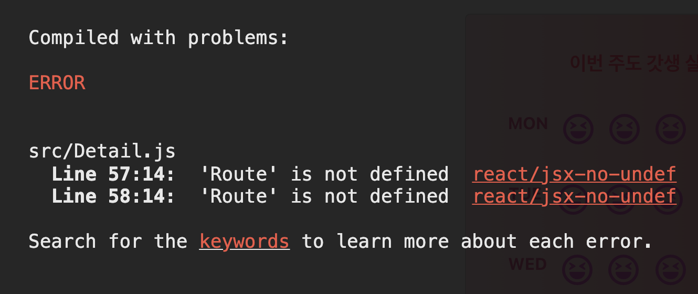

자바스크립트에서 타입스크립트로 마이그레이션 하던 중에 위와 같은 오류를 마주쳤다.

`.eslintrc.js` 파일에

```js
  "rules": {
    "react/jsx-no-undef": "error"
  }
```

위와 같이 추가하라는 몇몇 블로그들이 있었지만 `eslint`를 무시하는 꼴이 되는 거 같아서 이 방법은 안 쓰기로 했고,

구글링을 더 해본 결과

`eslint`에 다음과 같이 추가하면 됐다.

```js
 globals: {
    JSX: true,
},
```

그런데 왜 eslint에 저렇게 추가하는지 궁금해서 조금 더 찾아봤다.

일단 eslint는 문법 스타일에 관련한 툴이기 때문에 리액트와는 관련이 없고 그렇기 때문에 JSX를 인식하지 못한다.

인식하도록 할려면 따로 `eslint-plugin-react`라는 라이브러리를 설치해줘야 한다.

```
npm install eslint-plugin-react --save-dev
```
