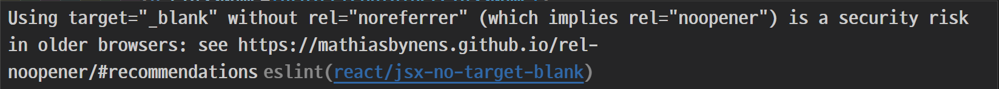
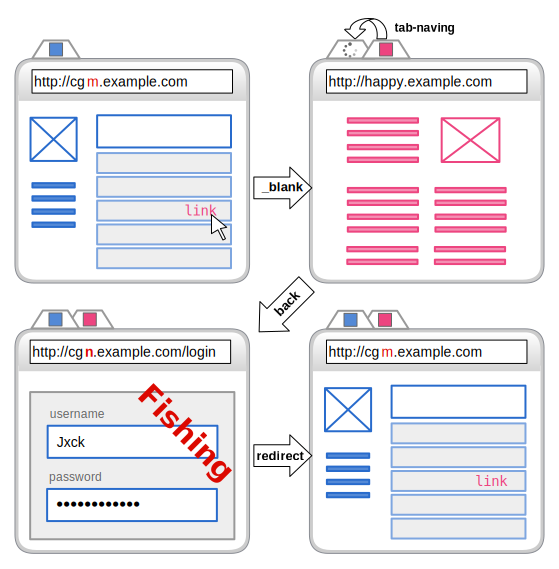

포트폴리오 작업을 하던 중에 내가 쓴 블로그를 집어넣으면서

a 태그에 링크를 집어넣었다.

```tsx
<a
  href="https://haseungdev.vercel.app/React/%EB%8B%89%EB%84%A4%EC%9E%84%20%EC%9E%90%EC%9D%8C,%EB%AA%A8%EC%9D%8C%20%EC%B2%98%EB%A6%AC%20%EB%B0%8F%20%EB%8B%89%EB%84%A4%EC%9E%84%20%EB%B3%80%EA%B2%BD%ED%95%98%EA%B8%B0/"
  target="_blank"
>
  React-hook-form을 이용하여 닉네임 실시간 검증
</a>
```

링크를 클릭했을 때, 기존 페이지에서 다른 페이지로 변경되는 게 싫어서

새 탭으로 열기 기능인 `target='_blank'`를 설정해줬더니

아래처럼 경고가 떴다.


<br />
noopener나 noreferrer 속성이 없으면 오래된 브라우저에서는 보안상 위험이 있다고 알려주는 거 같다. 그래서 이번에는 noopener와 noreferrer에 대해 조사해보기로 했다.

## noopener

위에서 한 것처럼 `target='_blank'` 만 사용하면 보안상 위험하고 성능 저하가 있다.

또한 새롭게 열린 페이지에서 JavaScript를 통해 원본 페이지에 직접 접근할 수 있게 되는 것이다.

이 원본 페이지는 `window.opener`를 이용해서 접근이 가능한 데 이를 **탭 내빙**이라 한다.

### 탭 내빙이란?


<br />

1. 사용자가 특정 사이트(cgn.example.com)에 접속한 후 다른 사이트로 갈 수 있는 외부 링크(happy.example.com) 클릭
2. 새 탭에서 다른 사이트(happy.example.com) 열림, 이 사이트에서 `window.opener.location`을 피싱 사이트(https://cgn.example.com/login)로 연결
3. 사용자가 본래 탭으로 돌아오면 로그인이 풀렷다고 생각해서 아이디,비밀번호 입력
4. 이 피싱 사이트에서 아이디,비밀번호를 탈취한 후 원래 사이트(cgn.example.com)로 리다이렉션, 그러나 사용자는 알 수 없음.

## 이를 어떻게 막을 수 있을까?

rel 속성으로 `noopener`를 지정해주게 되면 링크된 페이지에서 `window.opener`을 사용하여 링크를 건 페이지를 참조할 수 없게 할 수 있다.

다행인 것은, **크롬 88버전, 사파리 68버전**부터는 `target='_blank'`의 기본 동작이 <span style='font-weight:bold'>`noopener`</span>로 동작하도록 변경이 되었다.

그리고 SEO에는 영향을 미치지 않는다고 한다.

## noreferrer

`noopener`와 동일하게 새 탭에서 열린 사이트가 `window.opener` 객체에 접근하는 것을 방지하지만, 다른 페이지를 탐색할 때 브라우저가 참조 페이지의 주소를 보내지 못하게 한다는 것이 `noopener`와 다른 점이다. 즉, <span style='background-color:yellow;font-weight:bold'>링크를 클릭할 때 해당 유입이 어디서 왔는지에 대한 정보</span>가 제공되지 않는다.

그렇기 때문에 구글 애널리틱스 같은 통계 분석 도구에서 해당 트래픽은 <span style='background-color:yellow;font-weight:bold'>추천 유입</span>(<span style='font-weight:bold'>다른 사이트나 특정 링크를 통해 접근하는 경우</span>)이 아닌 <span style='background-color:yellow;font-weight:bold'>직접 유입</span>(<span style='font-weight:bold'>해당 URL을 직접 입력하는 경우</span>)으로 나타난다.

noreferrer의 경우에도 SEO에는 영향을 미치지 않는다고 한다.

## 그럼 위 둘 중에 하나만 써야 할까, 다 써야 할까?

최신 브라우저는 두 속성 모두 지원하지만, 일부 구형 브라우저에서는 `noreferrer`만 지원하는 경우도 있기 때문에 일반적으로는 `rel='noreferrer noopener'`로 명시해줘야 한다.

## Reference

https://joshua-dev-story.blogspot.com/2020/12/html-rel-noopener-noreferrer.html

https://yozm.wishket.com/magazine/detail/1586/

https://blog.jxck.io/entries/2016-06-12/noopener.html

https://blog.socialmkt.co.kr/464

https://html.spec.whatwg.org/multipage/links.html#link-type-noopener
