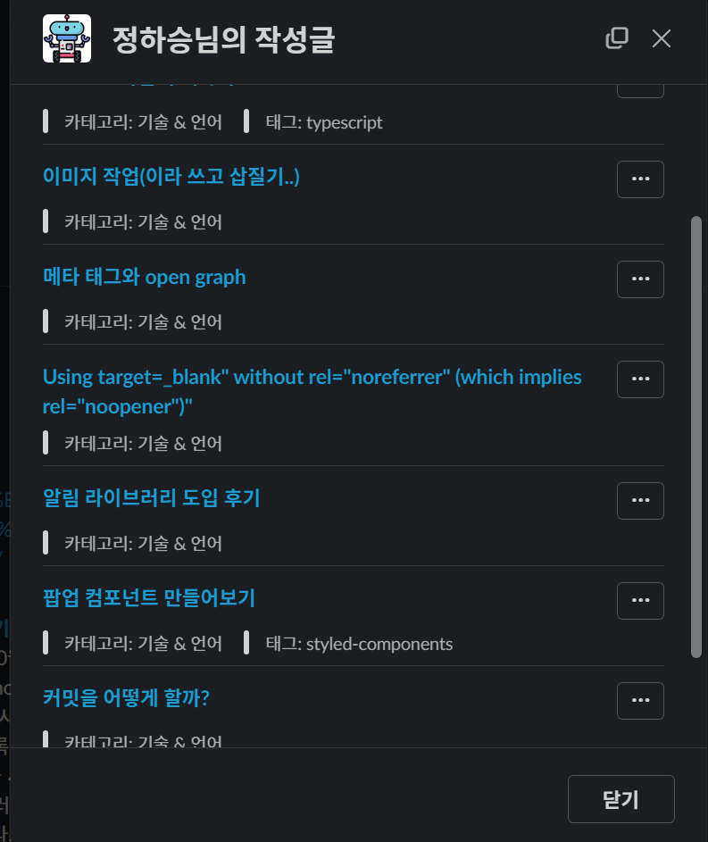

### 하반기가 되었다.

글또 8기를 1월부터 시작해서 어제자로 마무리가 되었는데 아직도 '취준' 상태다.

최근 들어서 서류 합격률이 조금씩 오르고 있어서 올해 본 면접만 10개 좀 넘는 상태다.

이제는 서류에는 문제가 없지만 말을 좀 잘하는 연습을 해야 할 것 같다.

### 글또 활동

 

면접을 핑계로 패스 2회권을 다 썼지만 그래도 꾸준히 쓴 편이라고 생각한다.

글을 주기적으로 쓰면서 들었던 생각은 이론에만 대해 설명하는 게 아니라 개인적으로 얻은 경험에 이론을 곁들이는 게 더 낫다고 생각했다.

지금도 쓰고자 하는 소재가 있기 때문에 주기적으로 글을 써보는 의도적 훈련을 해볼 것이다.(글또 덕분..)

### 좋았던 점

만약에 글또를 시작하지 않았더라면 마냥 나태한 상태로 지냈을 것이다. 블로그를 쓰더라도 한달에 1~2번? 정도 썼을 거 같은데
덕분에 내가 쓴 글을 다시 돌아볼 수도 있게 되었다.

그리고 다른 사람들이 쓴 글을 보면서 프로젝트 아이디어를 떠올리거나 블로그 주제에 대해서도 생각해 볼 수 있었다.

### 아쉬웠던 점

6개월의 기간 동안 커피드백이나 반상회가 몇 차례 열렸는데 지방에 거주하고 있다보니 참여하지 못했다.

또 한 가지 아쉬웠던 점은 다른 사람이 썼던 블로그에 직접 찾아가서 댓글을 단 사람도 있을 지 모르겠으나, 적어도 슬랙에서는 피드백을 주고받는 모습을 거의 볼 수 없었다.

### 마무리

우연히 다른 사람의 깃허브 프로필을 보다가 시작하게 된 글또인데, 6개월 동안의 긴 기간 동안 중도 포기를 안 한 자신에 대해 칭찬 아닌 칭찬을 해주고 싶다.

글또에 참여하면서 확실히 얻어갈 수 있는 것은 블로그 작성에 대한 꾸준함인 것 같다.

다음 기수에 참여하게 된다면 기술 서적을 읽고 간단하게 리뷰해보는 글을 작성해보고 싶다.
