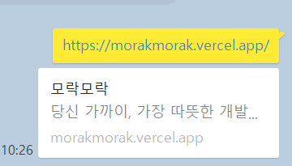
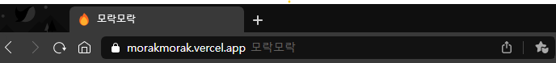
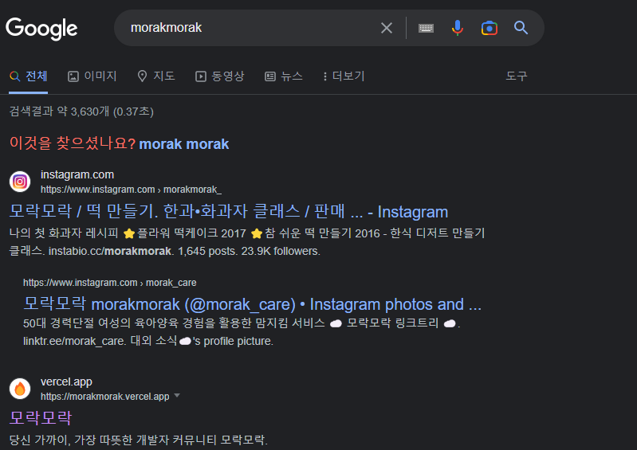

블로그를 보다보면 프리뷰가 적용된 웹사이트들을 봐왔었는데 나도 한번 적용을 해보고 싶었다.

팀 프로젝트 당시 Next.js를 사용했었는데 `_app.tsx` 에 다음과 같이 open graph를 적용했다.

```js
<meta property="og:image" content="../public/morak-main-1.png" />
```

간단하게 카톡에서 테스트해봤다.



<br/>

근데 웬걸? 썸네일이 안보인다...

chatGPT에게 물어보니 다음과 같이 수정하라고 한다.

```js
<meta
  property="og:image"
  content="https://morakmorak.vercel.app/morak-main-1.png"
  alt="thumbnail1"
/>
```


이제 잘 나온다.

내가 처음에 했던 걸 다시보니 public이라는 폴더를 통해 로컬에서 추가했었는데 배포 링크(https://morakmorak.vercel.app) 에서는 당연히 보일리가 없다...

그런데 이렇게 메타 태그나 open graph를 왜 적용해야 할까?

### 메타 태그

메타 태그는 웹페이지에 대한 정보를 명시하기 위해 사용되는 HTML 태그다.

유저가 보기에는 위와 같은 태그를 추가하는 게 무슨 차이가 있는지 구별은 못하지만 검색 엔진 같은 경우에는 웹페이지를 읽어들이는 과정에서 메타 태그의 내용들이 어떻게 표시될지를 결정하는 중요한 요소다. 즉, <span style='color:red'>**SEO**</span>에 많은 영향을 끼치는 것이다.

```html
<title>모락모락</title>
<meta name="description"content="당신 가까이, 가장 따뜻한 개발자 커뮤니티 모락모락"></meta>
```

프로젝트를 하면서 넣었던 html 코드인데,
먼저 사이트 제목을 표시하기 위해 `title` 태그를 쓰는데 예를 들어 '메타 태그'라는 제목으로 검색을 했다면 검색 엔진 최적화가 잘 되어있는 사이트는 바로 최상단에 뜰 것이다.

<div style='text-align:left'>1. SNS 공유</div>
<br/>

<br/>
<div style='text-align:left'>2. 웹 브라우저</div>
<br/>

<br/>

위처럼 카카오톡 같은 SNS에서도 제목이 바로 보이고, 웹 브라우저의 상단에도 바로 제목이 보이게 된다.

`name`과 `content` 속성을 추가할 수 있다.

참고로, 메타 태그들은 `<head>` 태그에 집어넣어야 한다. 나같은 경우에는 Next를 사용했기 때문에 Next에 있는 `<Head>` 태그를 이용했다.

보통 웹 페이지 상세 설명은 **`영문 160자, 한글 80자`** 이내로 하는 것이 좋다고 한다.

### Open Graph

블로그나 웹사이트를 SNS에 공유하면서 메타 태그가 점점 중요해지고 있는 추세다. 나같은 경우에는 카카오톡을 통해 이용하고 있기도 하다.

보통 웹사이트 링크를 입력하게 되면 카드 형태로 프리뷰를 보여주게 된다.

```tsx
<meta property="og:url" content="https://morakmorak.vercel.app/" />
<meta property="og:type" content="website" />
<meta property="og:title" content="모락모락" />
<meta property="og:description" content="당신 가까이, 가장 따뜻한 개발자 커뮤니티 모락모락"/>
<meta property="og:image" content="https://morakmorak.vercel.app/morak-main-1.png"/>
```

나는 위처럼 `url`,`type`,`title`,`description`,`image` 5개 정도로 적용했다. 참고로 이 태그들이 가장 많이 쓰인다고 한다.

### 느낀 점

팀 프로젝트를 하면서 단순히 SEO 때문에 Next를 채택했었는데 이게 무조건 SEO를 높여주는 게 아니라고 생각을 했고, 결국 메타 태그와 Open Graph를 적용하게 됐다. 덕분에 프로젝트 메인에서 LightHouse SEO를 10% 가량 높여서 80% 정도로 측정됐다.


<br/>

여담으로 morakmorak이라고 치면 과연 어디에 뜨는지 확인해봤는데 두번째에 위치하고 있는 걸 보니 나름 SEO 작업이 잘 된것 같다.

### Reference

https://www.daleseo.com/html-meta-tags-for-seo/
https://yozm.wishket.com/magazine/detail/816/
https://ogp.me/
