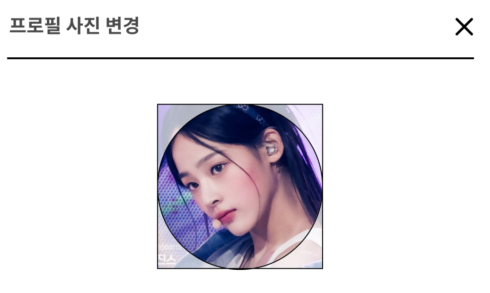
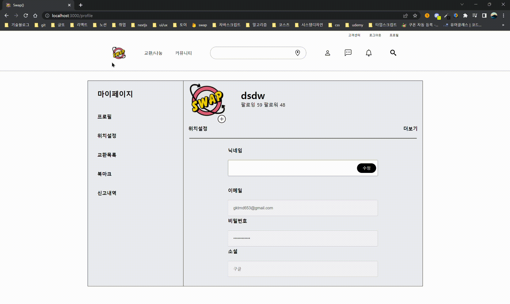

<br />

사이드 프로젝트 디자인을 참고하면서 실제로 구현해보고 싶었는데 며칠을 헤맸던 거 같다...ㅋㅋㅋ

사각형 부분은 뒷 배경만 opacity 값을 다르게 주면 되는거였는데 CSS가 계속 발목을 잡았다.

```tsx
// 이미지 업로드 및 삭제에 대한 모달

const ProfileImageModal = ({ closeEvent }: CloseProps) => {
  const storage = getStorage();
  const [imgName, setImgName] = useState('');

  const [imgUpload, setImgUpload] = useState<FileTypes | null>(null);
  const [imgUrl, setImgUrl] = useRecoilState(ImgUrlArrState);

  // 업로드
  const uploadImageToStorage = () => {
    if (imgUpload === null) return;

    const id = Date.now() / imgUpload.name.length;
    const imageRef = ref(storage, `images/${imgUpload.name}_${id}`);

    uploadBytes(imageRef, imgUpload as File).then((snapshot) => {
      getDownloadURL(snapshot.ref).then((url) => {
        setImgUrl((prev) => [...prev, { url, id: `images/${imgUpload.name}_${id}` }]);
        setImgUpload(null);
      });
    });
  };

  // 이미지 삭제
  const handleDeleteButtonClick = (event: React.MouseEvent<HTMLElement>) => {
    event.preventDefault();
    if (confirm('사진을 삭제하시겠습니까?')) {
      handleDelete(event);
      setImgUpload(null);
      setImgName('');
    }
  };

  const handleSubmit = (event: React.FormEvent<HTMLFormElement>) => {
    event.preventDefault();
    if (!imgUpload) return;
    uploadImageToStorage();
  };

  const handleDelete = (event: React.MouseEvent<HTMLElement>) => {
    const deleteRef = ref(storage, event.currentTarget.id);
    deleteObject(deleteRef);
    setImgUrl(imgUrl.filter((obj) => obj.id !== event.currentTarget.id));
  };

  useEffect(() => {
    if (imgUpload !== null) uploadImageToStorage();
  }, [setImgUrl]);

  return (
    <>
      <Modal>
        <PreviewContainer imgUrl={imgUrl} />
        <Form onSubmit={handleSubmit}>
          <ImageUploader imgName={imgName} setImgUpload={setImgUpload} setImgName={setImgName} />
          <ButtonContainer>
            <Button onClick={handleDeleteButtonClick} id={imgUrl[0]?.id}>
              삭제
            </Button>
            <Button type="submit">저장</Button>
          </ButtonContainer>
        </Form>
      </Modal>
      <BackgroundBlur />
    </>
  );
};

// 이미지를 올렸을 때 프리뷰 보여주기

const ProfileWrap = styled.div`
  width: 8rem;
  height: 8rem;
  margin: 0 auto;
  position: relative;
`;

const PreviewOuterImage = styled.div<{ url?: string }>`
  width: 7.9rem;
  height: 7.9rem;
  background-image: url(${(props) => props.url});
  background-size: cover;
  background-position: center;
  position: absolute;
  border-radius: 4rem;
  border: 1px solid black;
`;

const PreviewImgPositionWrap = styled.div<{ url: string }>`
  &::before {
    content: '';
    background-image: url(${(props) => props.url});
    background-size: cover;
    opacity: 0.5;
    position: absolute;
    inset: 0;
  }
`;

const PreviewContainer = ({ imgUrl }: ImgUrlProps) => {
  return (
    <ProfileWrap>
      {imgUrl.map((item) => {
        return (
          <PreviewImgPositionWrap key={item.url} url={item.url}>
            <PreviewOuterImage url={item.url} />
          </PreviewImgPositionWrap>
        );
      })}
    </ProfileWrap>
  );
};
```



<br />

구글링을 열심히 해 본 결과, 코드에서처럼 `PreviewImgPositionWrap` 에 before selector를 씌워주니 디자인처럼 구현된 거 같기는 한데,

CSS 구현단에서 정말 `<{ url: string }>`이 두번씩이나 적을 필요가 있는지는 더 연구해봐야 할 것 같다.

사진 업로드 테스트를 하면서 파이어베이스에 너무 요청을 보낸 탓인지 할당량을 초과해버렸다...


<br />

다음날에 이거랑 같이 골머리를 앓던 사진 삭제 기능도 팀원 덕분에 구현됐다.

그런데 이 글을 쓰기 며칠전에는 따로 버그가 없었는데,

사진 저장 후에 삭제를 하면 파이어베이스 스토리지에 있는 것과 함께 프리뷰도 삭제하고 싶었는데...

타입스크립트를 쓰면서 그런건지, 저장 버튼 클릭 후에 삭제 버튼을 클릭하면 프리뷰가 삭제가 안되고 있어서 어디서 잘못된건지 봐야할 거 같다..


<br />
