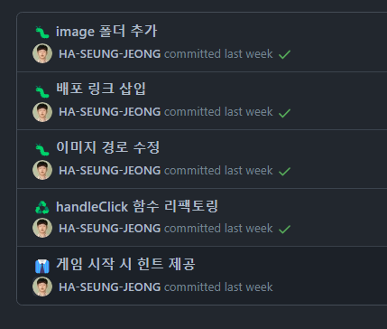

 

내가 올렸던 커밋 중 일부분인데, 그냥 '이 정도 기능만 추가하고 커밋해야겠다.' 라는 생각으로 작업을 하다 보니 커밋에 대한 기준이 없다고 생각이 들었다.

간혹, 한 번에 여러 로직이나 스타일 수정을 했을 때 이 부분을 어떻게 커밋 메세지로 표현할지도 애매했다.

물론 나 혼자 할 때는 크게 문제는 없겠지만 팀으로 작업하는 경우가 훨씬 많기 때문에 협업을 할 때는 어떤 기준으로 커밋을 하는지 궁금했다.

### 하나의 Action, 하나의 Commit

이게 원칙이라고는 하지만 어려운 거 같다. 예를 들어 css에서 말줄임표 기능만 구현했다고 했을 때,

이걸 과연 커밋으로 올려도 될 만한 것인지 의문이 들었다.

물론 잘게 쪼개면 좋긴 하겠지만, 아직 팀으로 협업한 경험이 많지는 않아서 크게 와닿지는 않는 부분이다.

### 커밋 메시지만 봐도 이해할 수 있도록

개인적으로 작업하면 내가 한 부분은 내가 잘 아니까 문제가 없다고 생각했지만, 일주일 정도만 지나고 나서 다시 봤을 때 어떻게 작업했는지 잊은 채로 코드를 다시 한번 더 살펴봐야 하는 번거로움이 있었다.

협업할 때는 코드가 정신없이 휘몰아치기(?) 때문에, 예를 들어 **어떤 함수**에서 **어떤 로직**을 **어떻게 변경**했는지 자세하게 적으면 좋을 것이다.

그렇게 하면 커밋을 다시 되돌리는 등의 작업이나 코드 리뷰를 할 때 시간 낭비를 덜 하게 될 것이라고 추측해본다.

참고로 제목은 50자, 본문은 72자로 권장된다고 한다.

팀 프로젝트를 진행할 때는 커밋 템플릿에 맞춰서 진행했지만, 혼자 작업할 때는 굳이 룰을 따라야 할 필요는 없으니까 안일했던 것 같다.

버릇을 들이기 위해서 의도적으로 자세하게 작성해 봐야겠다....

### 영어 vs 한글?

가끔 깃허브를 돌아다니다가 영어로 커밋을 올린 경우도 볼 수 있었는데,

영어는 명령형(e.g "Add login feature")., 한글로는 명사형(e.g "기능 이슈 해결").으로 표현하는 것이 좋다고 한다.

이 부분은 팀 컨벤션이 존재한다면 거기에 따르는 게 맞다고 생각하는 부분이다.

다음에는 아예 영어로만 작성해도 재밌을(?) 것 같다.

### 또 다른 방법?

최근에는 아예 Issue에 투두리스트를 만들어서 해당 기능 구현 완료 시 체크도 하고 커밋도 그 때 올리는 방식으로 진행하고 있고, 특히 혼자 작업할 때는 그렇게 해보려고 한다.

### 마무리

그동안 내 나름대로 커밋을 잘 작성했다고 생각했지만 블로그나 공식 문서를 찾아보고 내가 했던 작업을 보니까 아직 부족한 부분이 많은 것 같다.

유명한 오픈소스들은 어떻게 작업이 이루어지는지 살펴봐야 할 필요가 있다.

### Reference

https://jaeheon.kr/257

https://github.com/RomuloOliveira/commit-messages-guide/blob/master/README_ko-KR.md

https://jh-make.tistory.com/entry/Git-commit
