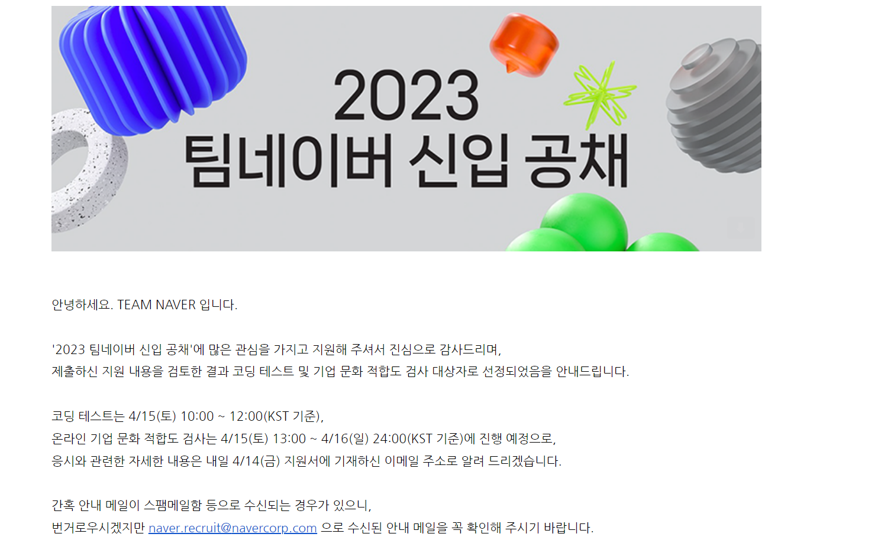

 

그 동안 네이버에 몇 번 지원은 했지만 경험이 너무너무 없어서 도저히 쓸 거리가 없었는데, 프로젝트도 2개를 해봤기 때문에 어느정도 경험이 있어서 써보기로 했다.

공고가 뜬 뒤부터 매일 조금씩 써내려가서(feat.GPT...) 마감 이틀 전에 제출했다.

11일부터 서류 검토라고는 했지만 '설마 오겠어?' 하면서 솔직히 기대 같은 건 하나도 안했는데

오늘 오후에 메일로 연락이 왔다....!

당장 이번주 토요일에 코테인데... 코테... 손 놓은 지 꽤 돼서 걱정이다...

그래도 다 경험이고, 어떤 문제가 나오는지는 파악해 볼 수 있으니 그걸로 다행이다...
